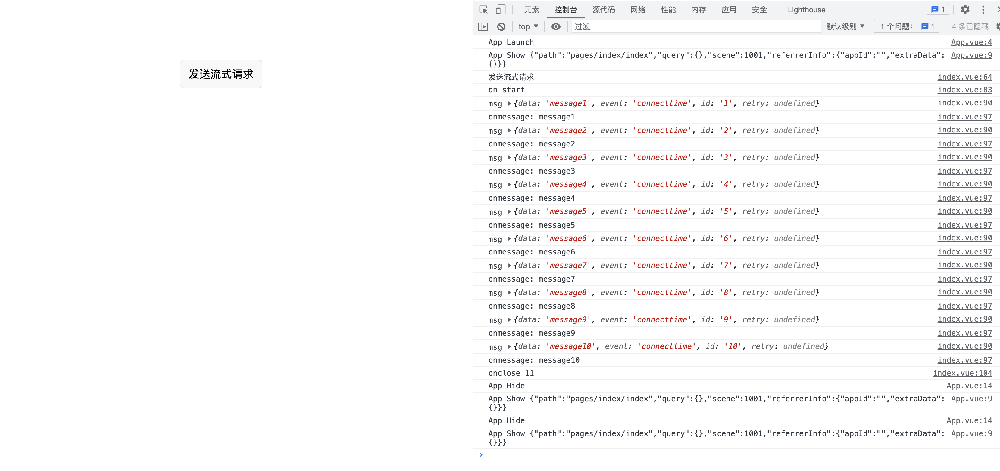
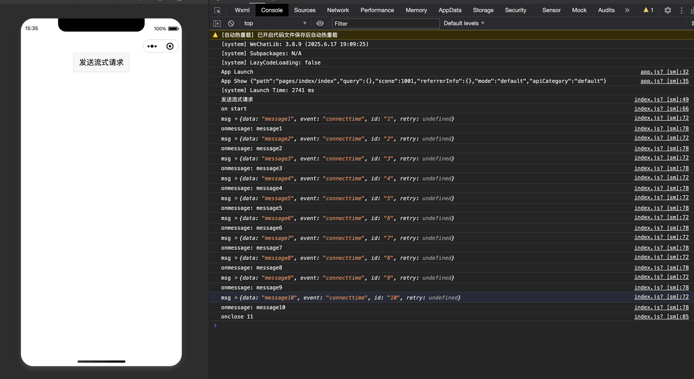

# 小程序SSE工具库
参考了@microsoft/fetch-event-source做的微信小程序版本,使用方法和fetch-event-source保持一致

npm包地址：https://www.npmjs.com/package/@chenroy/fetch-event-source-miniprogram

## 安装
npm i @chenroy/fetch-event-source-miniprogram

## 使用
```
import { EventStreamContentType, fetchEventSource } from '@chenroy/fetch-event-source-miniprogram'

const _fetchUrl = 'http://localhost:3001/sse';
const token = ''

fetchEventSource(_fetchUrl, {
    method: 'GET',
    headers: {
      'Accept': 'application/json, text/plain',
      'Cache-Control': 'no-cache',
      'Connection': 'keep-alive',
      'Authorization': token
    },
    onopen: async (res: any) => {
        console.log('on start')
    },
    onmessage(msg: any) {
      console.log('msg', msg)
      try {
        // 处理接收到的流式数据
        const rawData = JSON.parse(msg.data)
        const data = rawData.data
        console.log('onmessage:', data)
      } catch (error) {
        console.error('onmessage:', msg.data)
      }
    },
    onerror: () => {
      console.log('onerror')
    },
    onclose: () => {
      console.log('onclose')
    },
    openWhenHidden: true,
  })
```

## demo
packages/uni-app文件夹里面是一个uni-app的项目，包含了兼容h5和微信小程序写法的demo，可以参考下面调试命令运行查看效果

### H5 Demo 效果


### 微信小程序 Demo 效果


## 调试

### 安装所有依赖
```bash
pnpm i
```

## 调试h5的demo
```bash
pnpm run dev:h5
```
该命令会同时启动SSE服务器和H5开发服务器

## 调试小程序的demo
```bash
pnpm run dev:uniapp
```
该命令会同时启动SSE服务器和微信小程序开发服务器


## 其他命令

### 启动测试的SSE服务器
```bash
pnpm run sse:dev
```

# 注意事项
由于微信小程序没有浏览器的Request对象，所以onopen事件回调的第一个response参数是微信小程序wx.request返回的header对象
https://developers.weixin.qq.com/miniprogram/dev/api/network/request/wx.request.html

### 微信小程序在onopen回调获取header信息
```
response.header['content-type']?.startsWith(EventStreamContentType) //通过响应头判断是否是SSE流

```

### h5在onopen回调获取header信息
```
response.headers.get('content-type')?.startsWith(EventStreamContentType) //通过响应头判断是否是SSE流

```

